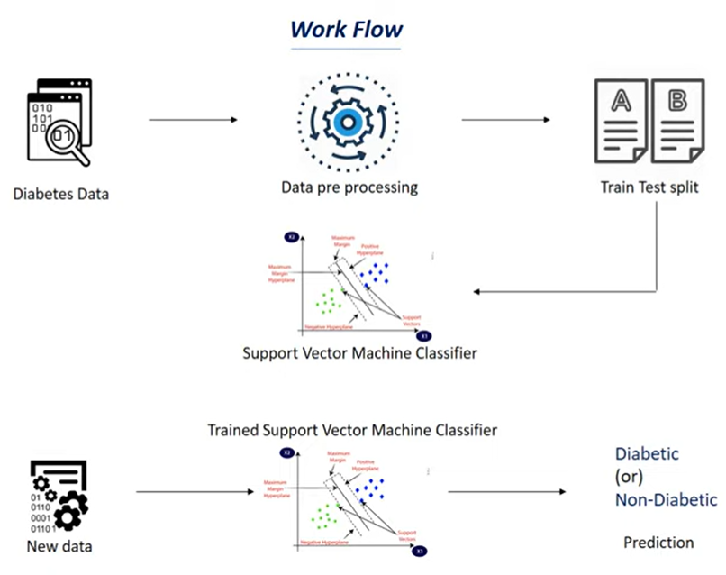

# Data Driven Health: Predicting Diabetes with Python and Support Vector Machine

## Project Overview
This project aims to predict diabetes in individuals using a Support Vector Machine (SVM) model. The dataset used for training and evaluation is the PIMA Diabetes Dataset, which includes various health-related features.

## Project Workflow



### 1. Importing Dependencies
The necessary Python libraries are imported, including NumPy, Pandas, and scikit-learn components such as StandardScaler, train_test_split, Support Vector Machine (SVM), and accuracy_score.

### 2. Data Collection and Analysis
The PIMA Diabetes Dataset is loaded into a Pandas DataFrame, and basic statistics are presented to understand the dataset better. The class distribution of the 'Outcome' variable (0 for non-diabetic, 1 for diabetic) and mean values grouped by 'Outcome' are also displayed.

### 3. Data Preprocessing
The dataset is separated into features (X) and labels (Y). Standardization is performed on the feature data using StandardScaler to bring all features to the same scale.

### 4. Train-Test Split
The standardized data is split into training and testing sets using the train_test_split function. The stratify parameter is used to ensure a balanced distribution of classes in both sets.

### 5. Training the Model
A Support Vector Machine classifier with a linear kernel is trained using the training data.

### 6. Model Evaluation
The accuracy score is calculated for both the training and test datasets to assess the model's performance.

### 7. Making Predictions
A predictive system is created, allowing users to input new data for prediction. The input data is standardized before being fed into the trained SVM model, and the prediction is displayed.

## Results
The SVM model achieved an accuracy of approximately 78.7% on the training data and 77.3% on the test data, indicating reasonable performance in predicting diabetes.

## How to Use the Predictive System
To use the predictive system, provide a new set of health-related features (Pregnancies, Glucose, BloodPressure, etc.) as input_data. The system will then output whether the person is predicted to be diabetic or not.

### Example:
```python
input_data = (5, 166, 72, 19, 175, 25.8, 0.587, 51)
# Follow the steps in the documentation to make predictions.
```
## Get Started

In a Terminal Copy This:

```bash
git clone https://github.com/GaurabKundu1/Data-Driven-Health-Predicting-Diabetes-with-Python-and-Support-Vector-Machine.git
```
Now Run:

```bash
pip install requirements.txt
```

## Conclusion
This project demonstrates the use of a Support Vector Machine to predict diabetes based on health-related features. The provided documentation guides users through the project's workflow, from data analysis to model evaluation and making predictions.

Feel free to explore and contribute to the project on GitHub!
